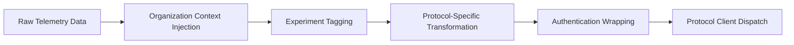

# Multi-Protocol Architecture Specification

## Overview

This document specifies the multi-protocol architecture for the briefcase-ai-telemetry-sdk, enabling support for multiple ingestion protocols while maintaining 100% backward compatibility with existing tRPC-based implementations.

## Protocol Types

### 1. TrpcLegacy (Default)

**Purpose**: Maintains backward compatibility with existing SDK installations.

**Endpoint Format**: `https://domain.com/api/trpc/ingest.telemetry`

**Data Format**: JSON wrapped in tRPC envelope
```json
{
  "json": {
    "apiKey": "bca_...",
    "session": { ... },
    "events": [ ... ],
    "metadata": { ... }
  }
}
```

**Authentication**:
- API Key format: `bca_` prefixed keys
- Header: `Authorization: ApiKey bca_...`
- Bearer tokens: `Authorization: Bearer <token>`

**Use Cases**:
- Legacy client migration
- Simple integration scenarios
- Development and testing environments

### 2. RestApi

**Purpose**: Modern REST API integration for dashboard users and new implementations.

**Endpoint Format**: `https://domain.com/api/v1/telemetry`

**Data Format**: Direct JSON payload
```json
{
  "organization": {
    "org_id": "org_123",
    "agent_group": "ml_agents",
    "environment": "prod"
  },
  "experiments": [
    {
      "experiment_id": "exp_456",
      "variant": "variant_a",
      "active": true
    }
  ],
  "session": { ... },
  "events": [ ... ],
  "metadata": { ... }
}
```

**Authentication**:
- JWT tokens from dashboard login
- Header: `Authorization: Bearer <jwt_token>`

**Use Cases**:
- Dashboard user integrations
- Modern web applications
- Service-to-service communication

### 3. KinesisStream

**Purpose**: High-throughput real-time data ingestion for enterprise AWS deployments.

**Endpoint**: AWS Kinesis Stream (no HTTP endpoint)

**Data Format**: JSON records partitioned by session_id
```json
{
  "record_type": "telemetry",
  "organization_id": "org_123",
  "agent_group": "ml_agents",
  "session_id": "session_456",
  "timestamp": "2024-11-24T10:00:00Z",
  "events": [ ... ],
  "experiments": [ ... ],
  "metadata": { ... }
}
```

**Authentication**:
- AWS STS credentials (IAM roles, temporary credentials)
- SDK handles credential refresh automatically

**Configuration**:
```json
{
  "stream_name": "briefcase-telemetry-stream",
  "partition_key_field": "session_id",
  "batch_size": 500,
  "compression": "gzip"
}
```

**Use Cases**:
- High-volume production environments
- Real-time analytics pipelines
- Enterprise AWS integrations

### 4. LakefsDirect

**Purpose**: Direct integration with LakeFS for data versioning and lineage tracking.

**Endpoint Format**: LakeFS API endpoints with repository-based storage

**Data Format**: Structured data files with versioning metadata
```json
{
  "lakefs_metadata": {
    "repository": "briefcase-telemetry",
    "branch": "main",
    "path": "/telemetry/{org_id}/{date}/session_{session_id}.json",
    "commit_metadata": {
      "message": "Telemetry data from {agent_group}",
      "committer": "briefcase-ai-sdk"
    }
  },
  "telemetry_data": {
    "organization": { ... },
    "session": { ... },
    "events": [ ... ],
    "experiments": [ ... ]
  }
}
```

**Authentication**:
- LakeFS access keys
- AWS STS credentials for S3 backend

**Configuration**:
```json
{
  "repository": "briefcase-telemetry",
  "branch": "main",
  "base_path": "/telemetry",
  "auto_commit": true,
  "commit_interval": "1h"
}
```

**Use Cases**:
- Data versioning and lineage tracking
- Compliance and audit requirements
- Data lake integrations

## Protocol Selection Strategy

### Automatic Protocol Detection

The SDK client uses the following logic to determine the appropriate protocol:

1. **Configuration Priority**: Explicitly configured `endpoint_type` takes highest priority
2. **Authentication-based Detection**:
   - JWT tokens → RestApi
   - STS credentials → KinesisStream or LakefsDirect
   - API keys (bca_) → TrpcLegacy
3. **Endpoint URL Pattern Detection**:
   - `/api/trpc/` → TrpcLegacy
   - `/api/v1/` → RestApi
   - Stream name → KinesisStream
   - LakeFS repository URL → LakefsDirect

### Fallback Strategy

```rust
// Primary endpoint fails
primary_protocol.send().await.map_err(|e| {
    // Try fallback endpoints in order
    for (fallback_type, fallback_url) in &config.fallback_endpoints {
        match fallback_type.send(data).await {
            Ok(_) => return Ok(()),
            Err(fallback_error) => continue,
        }
    }
    // All endpoints failed
    Err(e)
})
```

## Data Transformation Pipeline

### Transformation Flow



### Transformation Rules

#### Organization Context Injection
- Adds `organization` field to all telemetry records
- Injects repository naming for LakeFS based on `org_id` and `agent_group`
- Sets Kinesis partition keys based on organization context

#### Experiment Tagging
- Appends active experiment metadata to event records
- Tags events with experiment variants for A/B testing analysis
- Maintains experiment enrollment state across sessions

#### Protocol-Specific Transformations

**TrpcLegacy**:
```rust
fn transform_to_trpc(data: &TelemetryData) -> TrpcPayload {
    TrpcPayload {
        json: TelemetryPayload {
            api_key: config.legacy_api_key,
            session: data.session,
            events: data.events,
            metadata: data.metadata,
            // Organization and experiments added as metadata for backward compatibility
            organization: data.organization,
            experiments: data.experiments,
        }
    }
}
```

**RestApi**:
```rust
fn transform_to_rest(data: &TelemetryData) -> RestPayload {
    RestPayload {
        organization: data.organization.unwrap_or_default(),
        experiments: data.experiments,
        session: data.session,
        events: data.events,
        metadata: data.metadata,
        timestamp: chrono::Utc::now(),
    }
}
```

**KinesisStream**:
```rust
fn transform_to_kinesis(data: &TelemetryData) -> Vec<KinesisRecord> {
    data.events.into_iter().map(|event| KinesisRecord {
        record_type: "telemetry",
        organization_id: data.organization.org_id,
        agent_group: data.organization.agent_group,
        session_id: data.session.id,
        event: event,
        experiments: data.experiments,
        timestamp: chrono::Utc::now(),
    }).collect()
}
```

**LakefsDirect**:
```rust
fn transform_to_lakefs(data: &TelemetryData) -> LakeFSCommit {
    let path = format!("/telemetry/{}/{}/session_{}.json",
        data.organization.org_id,
        chrono::Utc::now().format("%Y-%m-%d"),
        data.session.id
    );

    LakeFSCommit {
        repository: config.repository,
        branch: config.branch,
        path: path,
        content: serde_json::to_vec(data).unwrap(),
        metadata: CommitMetadata {
            message: format!("Telemetry from {} at {}",
                data.organization.agent_group,
                chrono::Utc::now()
            ),
            committer: "briefcase-ai-sdk",
        }
    }
}
```

## Client Routing Logic

### Protocol Client Factory

```rust
pub struct ProtocolClientFactory;

impl ProtocolClientFactory {
    pub fn create_client(config: &EnhancedTelemetryConfig) -> Box<dyn ProtocolClient> {
        match config.endpoint_type {
            EndpointType::TrpcLegacy => Box::new(TrpcLegacyClient::new(config)),
            EndpointType::RestApi => Box::new(RestApiClient::new(config)),
            EndpointType::KinesisStream => Box::new(KinesisStreamClient::new(config)),
            EndpointType::LakefsDirect => Box::new(LakeFSDirectClient::new(config)),
        }
    }
}
```

### Multi-Protocol Client Manager

```rust
pub struct MultiProtocolClient {
    primary_client: Box<dyn ProtocolClient>,
    fallback_clients: Vec<Box<dyn ProtocolClient>>,
    transformer: Box<dyn DataTransformer>,
    experiment_manager: Box<dyn ExperimentManager>,
}

impl MultiProtocolClient {
    pub async fn send_telemetry(&self, data: &TelemetryData) -> Result<()> {
        // Transform data for primary protocol
        let transformed = self.transformer.transform_telemetry_data(data, self.primary_client.protocol_type())?;

        // Try primary client
        match self.primary_client.send_telemetry(&transformed).await {
            Ok(_) => return Ok(()),
            Err(e) => {
                tracing::warn!("Primary client failed: {}", e);

                // Try fallback clients
                for fallback_client in &self.fallback_clients {
                    let fallback_data = self.transformer.transform_telemetry_data(data, fallback_client.protocol_type())?;
                    if fallback_client.send_telemetry(&fallback_data).await.is_ok() {
                        return Ok(());
                    }
                }

                return Err(e);
            }
        }
    }
}
```

## Authentication Flow

### JWT Token Validation

```rust
pub struct JwtAuthProvider {
    client: reqwest::Client,
    token_cache: Arc<RwLock<Option<String>>>,
}

impl JwtAuthProvider {
    pub async fn validate_and_refresh_token(&self) -> Result<String> {
        // Check token expiration
        if let Some(token) = self.token_cache.read().await.as_ref() {
            if !self.is_token_expired(token) {
                return Ok(token.clone());
            }
        }

        // Refresh token logic
        let new_token = self.refresh_token().await?;
        *self.token_cache.write().await = Some(new_token.clone());
        Ok(new_token)
    }
}
```

### STS Credentials Management

```rust
pub struct StsCredentialProvider {
    credentials: Arc<RwLock<StsCredentials>>,
    role_arn: Option<String>,
}

impl StsCredentialProvider {
    pub async fn get_credentials(&self) -> Result<StsCredentials> {
        let creds = self.credentials.read().await;
        if !self.are_credentials_expired(&creds) {
            return Ok(creds.clone());
        }

        drop(creds);

        // Refresh credentials
        let new_creds = if let Some(role_arn) = &self.role_arn {
            self.assume_role(role_arn).await?
        } else {
            self.refresh_session_token().await?
        };

        *self.credentials.write().await = new_creds.clone();
        Ok(new_creds)
    }
}
```

## Performance Considerations

### Batching Strategies

**TrpcLegacy & RestApi**:
- HTTP request batching (default: 100 events)
- Connection pooling and keep-alive
- Retry with exponential backoff

**KinesisStream**:
- Put records batching (up to 500 records per batch)
- Automatic sharding based on partition key
- Built-in retry and error handling

**LakefsDirect**:
- File-based batching (time-based commits)
- Diff-based commits for efficiency
- Branch-based isolation

### Resource Management

```rust
pub struct ResourceManager {
    connection_pools: HashMap<EndpointType, reqwest::Client>,
    kinesis_client: Option<aws_sdk_kinesis::Client>,
    lakefs_client: Option<lakefs_client::LakeFSClient>,
}

impl ResourceManager {
    pub async fn get_http_client(&self, endpoint_type: EndpointType) -> &reqwest::Client {
        self.connection_pools.get(&endpoint_type)
            .expect("HTTP client not initialized for protocol")
    }

    pub async fn cleanup(&mut self) {
        // Close connections gracefully
        for (_, client) in self.connection_pools.drain() {
            // Connection cleanup handled by Drop trait
        }
    }
}
```

## Error Handling and Resilience

### Error Classification

```rust
#[derive(Debug, thiserror::Error)]
pub enum ProtocolError {
    #[error("Authentication failed: {0}")]
    AuthenticationError(String),

    #[error("Network error: {0}")]
    NetworkError(#[from] reqwest::Error),

    #[error("Protocol-specific error: {protocol} - {message}")]
    ProtocolSpecific { protocol: EndpointType, message: String },

    #[error("Configuration error: {0}")]
    ConfigurationError(String),

    #[error("Data transformation error: {0}")]
    TransformationError(String),
}
```

### Circuit Breaker Pattern

```rust
pub struct CircuitBreaker {
    failure_count: AtomicUsize,
    last_failure: AtomicU64,
    state: AtomicU8, // 0=Closed, 1=Open, 2=HalfOpen
}

impl CircuitBreaker {
    pub async fn call<F, T>(&self, f: F) -> Result<T, ProtocolError>
    where
        F: Future<Output = Result<T, ProtocolError>>,
    {
        match self.state() {
            CircuitState::Open => {
                if self.should_attempt_reset() {
                    self.set_state(CircuitState::HalfOpen);
                } else {
                    return Err(ProtocolError::CircuitBreakerOpen);
                }
            }
            _ => {}
        }

        match f.await {
            Ok(result) => {
                self.on_success();
                Ok(result)
            }
            Err(e) => {
                self.on_failure();
                Err(e)
            }
        }
    }
}
```

## Protocol-Specific Configuration Examples

### TrpcLegacy Configuration
```json
{
  "endpoint_type": "TrpcLegacy",
  "auth": {
    "ApiKey": {
      "key": "bca_your_api_key_here"
    }
  },
  "endpoint_url": "https://telemetry.briefcasebrain.com/api/trpc/ingest.telemetry",
  "protocol_configs": {
    "TrpcLegacy": {
      "timeout_ms": 10000,
      "retry_attempts": 3
    }
  }
}
```

### KinesisStream Configuration
```json
{
  "endpoint_type": "KinesisStream",
  "auth": {
    "StsCredentials": {
      "access_key_id": "AKIA...",
      "secret_access_key": "...",
      "region": "us-east-1"
    }
  },
  "protocol_configs": {
    "KinesisStream": {
      "stream_name": "briefcase-telemetry-stream",
      "partition_key_field": "session_id",
      "batch_size": 500,
      "compression": "gzip",
      "record_format": "json"
    }
  }
}
```

### LakefsDirect Configuration
```json
{
  "endpoint_type": "LakefsDirect",
  "auth": {
    "StsCredentials": {
      "access_key_id": "AKIA...",
      "secret_access_key": "...",
      "region": "us-east-1"
    }
  },
  "endpoint_url": "https://your-lakefs-instance.com",
  "protocol_configs": {
    "LakefsDirect": {
      "repository": "briefcase-telemetry",
      "branch": "main",
      "base_path": "/telemetry",
      "auto_commit": true,
      "commit_interval_minutes": 60,
      "commit_message_template": "Telemetry data from {agent_group} at {timestamp}"
    }
  }
}
```

This multi-protocol architecture ensures flexibility, scalability, and backward compatibility while enabling modern cloud-native integrations.